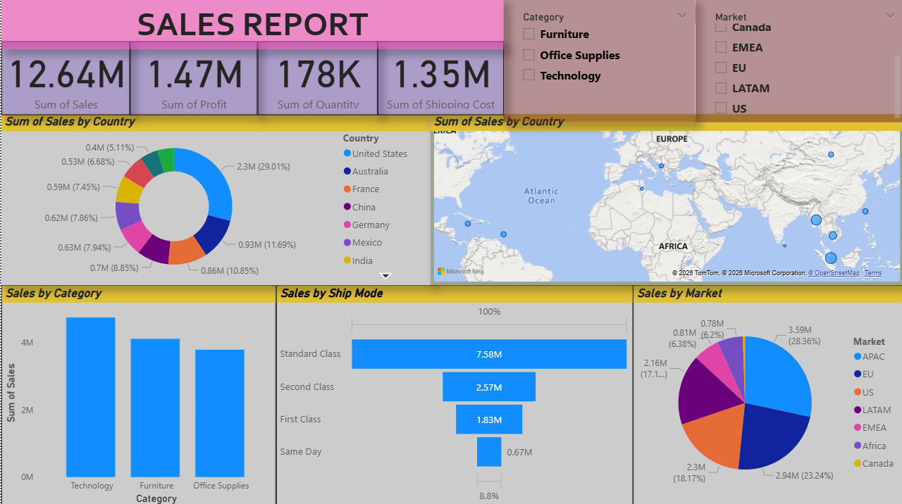

# Power BI Sales Dashboard

## Project Overview

This Power BI dashboard analyzes global sales performance across markets, categories, and shipping modes.

## Dashboard Features

* Sales KPI (Total Sales, Profit, Quantity, Shipping Cost)
* Sales by Country
* Sales by Market
* Sales by Category
* Sales by Ship Mode
* Interactive Filters

## Tools Used

* Microsoft Power BI
* Excel Dataset
* Data Visualization

## Key Insights

* Technology category generates highest revenue
* Standard class shipping dominates
* APAC market contributes highest sales

## Preview

## Files Included

* Sales_Dashboard_PowerBI.pbix
* Sales_Dashboard_PowerBI.pdf

## Author

 AJAY

